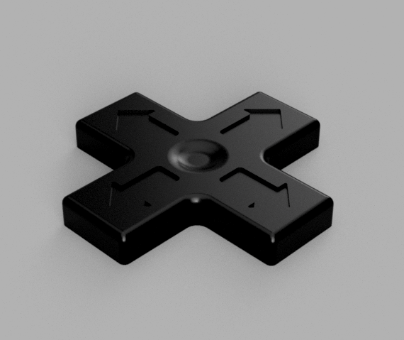
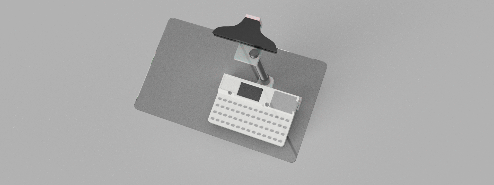

# M5Stack Cardputer Accessories

A small collection of 3D models of accessories for the M5Stack Cardputer.

---

## 3D Models

### Flat Gamepad
Cardputer D-Pad gamepad without a mounting mechanism. Can be secured using double-sided tape.
Checkout https://github.com/geo-tp/Cardputer-Game-Station-Emulators for a game station emulator! Shout out to @geo-tp for this cool emulator!

- **3D Model:** [`models/flat_gamepad.step`](./models/flat_gamepad.step)
- **STL File:** [`models/flat_gamepad.stl`](./models/flat_gamepad.stl)

### Magnifier Holder
A holder that mounts a rectangular magnifying lens on an arm above the Cardputer's screen, making the small display easier to read. It's built from two printable connectors — an inferior connector that attaches to the Cardputer and a superior connector that holds the magnifier arm.

You can buy the articulating arm here: [AliExpress Link](https://www.aliexpress.com/item/1005009994279927.html)

- **3D Model:** [`models/cardputer_magnifier.step`](./models/cardputer_magnifier.step)
- **Inferior Connector (3MF):** [`models/magnifier_inferior_connector.3mf`](./models/magnifier_inferior_connector.3mf)
- **Superior Connector (3MF):** [`models/magnifier_superior_connector.3mf`](./models/magnifier_superior_connector.3mf)

---

## License

This project is licensed under the GPL-3.0 License. See the [LICENSE](./LICENSE) file for details.